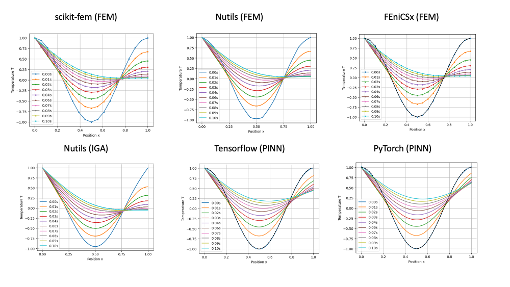
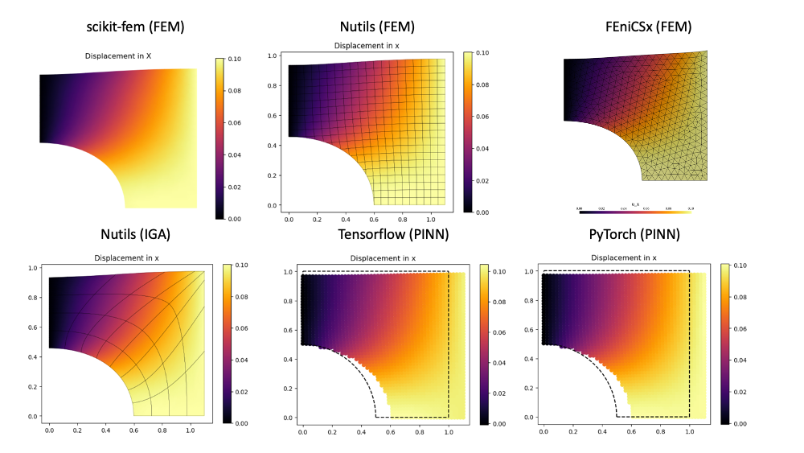

# Numerical examples
Application of several numerical algorithms and tools in Python to engineering problems.

## One-dimensional heat equation
Transient heat equation with fixed temperature at one end. 

Solved with: 
- scikit-fem (second order elements and Crank-Nicolson time integration)
- nutils (second degree spline elements and Crank-Nicolson time integration)
- tensorflow (PINN with 5 fully connected hidden layers)
- pytorch (PINN with 5 fully connected hidden layers)

## Two-dimensional plate hole example
Elastic problem of a simple plate with a hole.

Solved with: 
- scikit-fem (first order elements)
- nutils (second order elements)
- tensorflow (PINN with 5 fully connected hidden layers)
- pytorch (PINN with 5 fully connected hidden layers)

