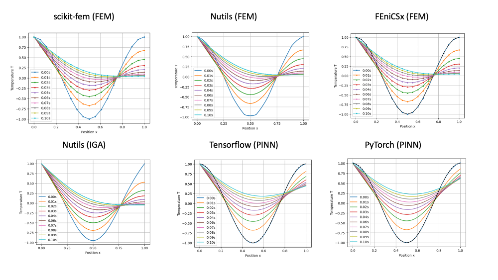
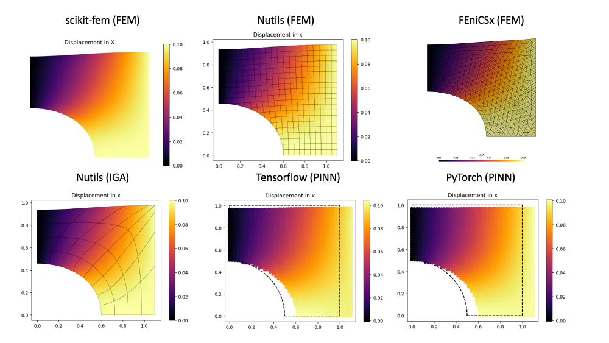

# Numerical examples
Application of several numerical algorithms and tools in Python to engineering problems.

## Setup

Most examples run in a single [uv](https://docs.astral.sh/uv/) environment:

```
uv sync
uv run jupyter lab
```

`uv sync` builds `.venv` from the committed `uv.lock`, so the examples run against
the exact versions the results were produced with. In VS Code, select `.venv` as
the kernel.

### FEniCSx

DOLFINx is not distributed on PyPI, so the two `fenicsx.ipynb` notebooks need a
separate conda environment:

```
conda create -n fenicsx -c conda-forge python=3.12 fenics-dolfinx pyvista ipykernel h5py
conda activate fenicsx
pip install matplotlib pygmsh trame trame-vtk trame-vuetify ipywidgets
```

## One-dimensional heat equation
Transient heat equation with fixed temperature at one end. 

Solved with: 
- scikit-fem (second order elements and Crank-Nicolson time integration)
- Nutils (second order standard elements and Crank-Nicolson time integration)
- Nutils (IGA with second degree spline elements and Crank-Nicolson time integration)
- FEniCSx (first order elements and implicit time integration)
- TensorFlow (PINN with five fully connected hidden layers)
- PyTorch (PINN with five fully connected hidden layers)



## Two-dimensional plate hole example
Elastic problem of a simple plate with a hole.

Solved with: 
- scikit-fem (first order elements)
- Nutils (second order standard elements)
- Nutils (IGA with second order spline elements)
- FEniCSx (first order elements)
- TensorFlow (PINN with five fully connected hidden layers)
- PyTorch (PINN with five fully connected hidden layers)


